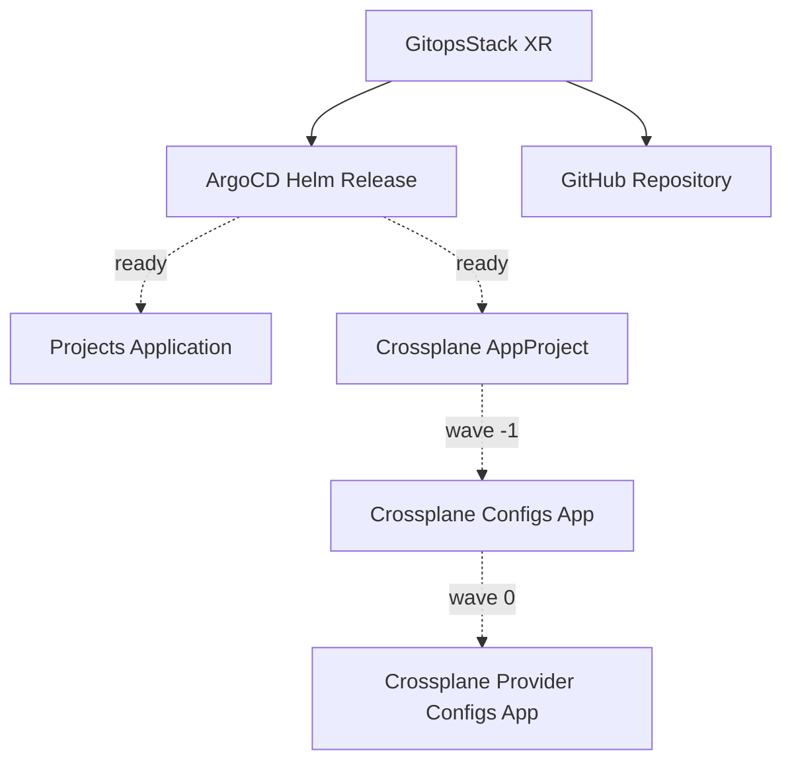
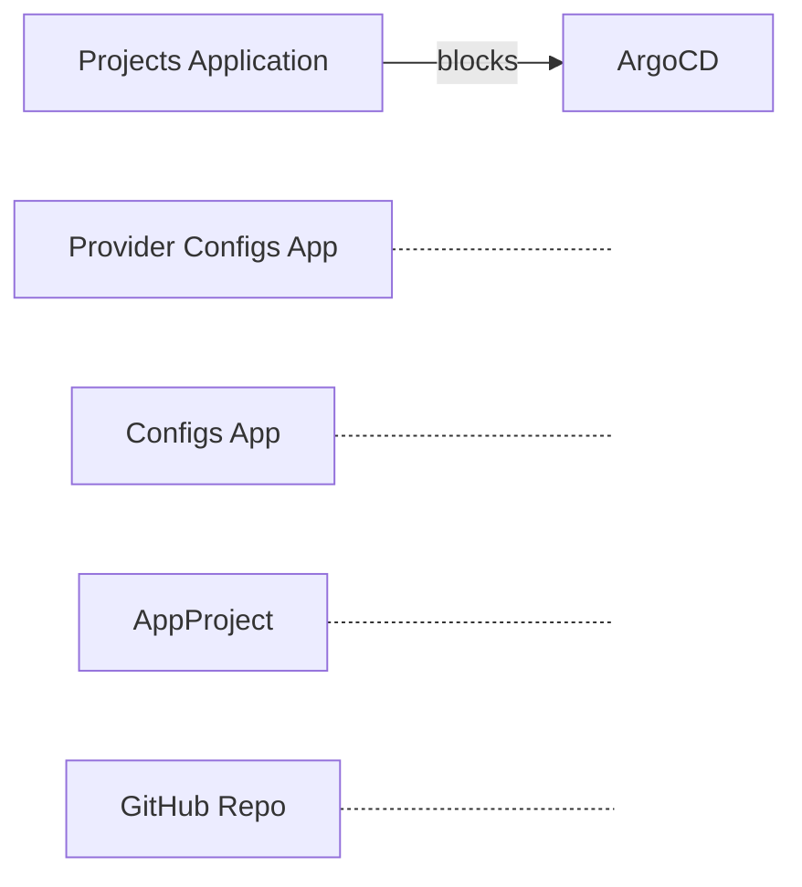

# gitops-stack

A single Crossplane resource that provisions a complete GitOps foundation: ArgoCD, a GitHub repository, and ArgoCD Applications wired to continuously sync from the repo.

## Why GitOps Stack?

**Without GitOps Stack:**
- 3 manual steps per cluster: install ArgoCD, create a repo, wire the two together
- ArgoCD Applications referencing wrong repo URLs or paths after copy-paste
- Deleting ArgoCD before its Applications causes orphaned resources and finalizer deadlocks
- GitHub repo creation is a manual, out-of-band process with inconsistent naming/settings
- No single source of truth for "what GitOps infrastructure does this cluster have?"

**With GitOps Stack:**
- One resource, one API — ArgoCD, GitHub repo, and Applications all wired automatically
- Repo URL derived from org + cluster name — rename the cluster and everything adjusts
- Safe deletion ordering enforced via Usage resources (projects app deletes before ArgoCD)
- GitHub repo created with consistent settings (topics, visibility, branch cleanup, templates)
- Optional Crossplane integration deploys configurations and provider configs via ArgoCD

## What Gets Deployed

```
                    ┌──────────────────────────────────┐
                    │          GitopsStack XR           │
                    └───────────────┬──────────────────┘
                                    │
                    ┌───────────────┼───────────────┐
                    ▼                               ▼
             ┌────────────┐                ┌────────────────┐
             │   ArgoCD   │                │ GitHub Repo    │
             │   (Helm)   │                │ (upjet-github) │
             └──────┬─────┘                └────────────────┘
                    │ ready
         ┌──────────┼──────────────────┐
         ▼          ▼                  ▼
  ┌────────────┐ ┌─────────────┐ ┌──────────────────┐
  │  Projects  │ │ Crossplane  │ │ Crossplane Apps   │
  │    App     │ │ AppProject  │ │ (configs +        │
  │            │ │             │ │  provider-configs) │
  └────────────┘ └─────────────┘ └──────────────────┘
                  └── only if crossplane.enabled ──┘
```

**Up to 7 composed resources:** 1 Helm Release + 1 GitHub Repository + up to 4 Kubernetes Objects + 1 Usage protection

| Resource | Type | Purpose |
|----------|------|---------|
| ArgoCD | Helm Release (`argo-cd` v9.4.3) | Continuous delivery platform |
| GitHub Repository | `repo.github.m.upbound.io` | GitOps source repository |
| Projects Application | Kubernetes Object (ArgoCD Application) | Syncs ArgoCD projects from the repo |
| Deletion Usage | Usage | Ensures projects app deletes before ArgoCD |
| Crossplane AppProject | Kubernetes Object (ArgoCD AppProject) | Scoped ArgoCD project for Crossplane |
| Crossplane Configs App | Kubernetes Object (ArgoCD Application) | Syncs Crossplane configurations |
| Crossplane Provider Configs App | Kubernetes Object (ArgoCD Application) | Syncs Crossplane provider configs |

## The Journey

### Stage 1: Getting Started

Two fields required. Everything else has sensible defaults.

```yaml
apiVersion: hops.ops.com.ai/v1alpha1
kind: GitopsStack
metadata:
  name: gitops
  namespace: default
spec:
  clusterName: my-cluster
  repository:
    org: hops-ops
```

This deploys:
- ArgoCD into the `argocd` namespace with CRDs, monitoring, and service monitors enabled
- GitHub repo `hops-ops/my-cluster-gitops` (private, auto-initialized)
- Projects Application syncing from `.gitops/deploy` in the repo (once ArgoCD is ready)

### Stage 2: Customizing for Your Team

Add labels, use a template repo, tune ArgoCD.

```yaml
apiVersion: hops.ops.com.ai/v1alpha1
kind: GitopsStack
metadata:
  name: gitops
  namespace: default
spec:
  clusterName: production
  labels:
    team: platform
    environment: production
  repository:
    org: hops-ops
    name: production-gitops
    description: GitOps for production cluster
    topics: [gitops, argocd, production]
    template:
      owner: hops-ops
      repository: platform-gitops-template
  argocd:
    values:
      server:
        ingress:
          enabled: true
          hostname: argocd.example.com
```

When `template` is set, the repo is created from the template instead of auto-init.

### Stage 3: Crossplane Integration

Enable ArgoCD-managed Crossplane resources for full platform automation.

```yaml
spec:
  clusterName: production
  repository:
    org: hops-ops
  applications:
    projects:
      path: .gitops/deploy
    crossplane:
      enabled: true
```

This adds 3 ArgoCD resources (gated on ArgoCD readiness):
- **AppProject** `crossplane` — scoped project allowing all sources and destinations
- **Application** `crossplane-configurations` — syncs from `resources/crossplane/configurations`
- **Application** `crossplane-provider-configs` — syncs from `resources/crossplane/provider-configs`

Sync waves ensure ordering: AppProject (-1) → configurations (0) → provider-configs (1).

### Stage 4: Local Development

For Colima/kind/minikube — use `default` provider configs instead of cluster-named ones.

```yaml
apiVersion: hops.ops.com.ai/v1alpha1
kind: GitopsStack
metadata:
  name: gitops
  namespace: default
spec:
  clusterName: local
  helmProviderConfigRef:
    name: default
  kubernetesProviderConfigRef:
    name: default
  githubProviderConfigRef:
    name: default
  repository:
    org: hops-ops
```

### Stage 5: Full Override

When you need complete control over ArgoCD's Helm values (bypassing all defaults):

```yaml
spec:
  argocd:
    overrideAllValues:
      crds:
        install: false
      server:
        replicas: 3
```

`overrideAllValues` replaces **all** defaults — chart defaults, monitoring config, everything. Use `values` for additive changes instead.

## Creation Order

Resources are created as their dependencies become ready:



ArgoCD and the GitHub repo start immediately. All Applications wait for ArgoCD to be ready.

## Deletion Order

Usage resources enforce safe teardown — dependents delete before the resources they depend on:



| Phase | Deletes | Waits for |
|-------|---------|-----------|
| 1 | GitHub repo, Crossplane apps, AppProject | nothing — immediate |
| 2 | Projects Application | nothing — immediate |
| 3 | ArgoCD | Projects Application gone |

The Usage ensures ArgoCD CRDs stay alive until all ArgoCD Application CRs are cleaned up.

## Spec Reference

| Field | Type | Required | Default | Description |
|-------|------|----------|---------|-------------|
| `clusterName` | string | yes | — | Target cluster name; drives naming defaults |
| `namespace` | string | no | `argocd` | Namespace for ArgoCD and applications |
| `labels` | map | no | `{}` | Custom labels merged with defaults |
| `managementPolicies` | []string | no | `["*"]` | Crossplane management policies |
| `helmProviderConfigRef.name` | string | no | `clusterName` | Helm ProviderConfig name |
| `helmProviderConfigRef.kind` | string | no | `ProviderConfig` | `ProviderConfig` or `ClusterProviderConfig` |
| `kubernetesProviderConfigRef.name` | string | no | `clusterName` | Kubernetes ProviderConfig name |
| `kubernetesProviderConfigRef.kind` | string | no | `ProviderConfig` | `ProviderConfig` or `ClusterProviderConfig` |
| `githubProviderConfigRef.name` | string | no | `default` | GitHub ProviderConfig name |
| `githubProviderConfigRef.kind` | string | no | `ProviderConfig` | `ProviderConfig` or `ClusterProviderConfig` |
| `argocd.name` | string | no | `argocd` | Helm release name |
| `argocd.namespace` | string | no | `namespace` | Per-component namespace override |
| `argocd.values` | object | no | `{}` | Helm values merged with defaults |
| `argocd.overrideAllValues` | object | no | — | Helm values replacing all defaults |
| `repository.org` | string | yes | — | GitHub organization |
| `repository.name` | string | no | `{clusterName}-gitops` | Repository name |
| `repository.description` | string | no | auto-generated | Repository description |
| `repository.visibility` | string | no | `private` | `public`, `private`, or `internal` |
| `repository.autoInit` | boolean | no | `true` | Create initial commit (ignored when template is set) |
| `repository.template.owner` | string | no | — | Template repo owner |
| `repository.template.repository` | string | no | — | Template repo name |
| `repository.topics` | []string | no | `[]` | Repository topics |
| `repository.deleteBranchOnMerge` | boolean | no | `true` | Auto-delete head branches on merge |
| `applications.projects.enabled` | boolean | no | `true` | Deploy the root Projects Application |
| `applications.projects.path` | string | no | `.gitops/deploy` | Path in repo to sync |
| `applications.crossplane.enabled` | boolean | no | `false` | Deploy Crossplane integration apps |

**ArgoCD chart defaults** (merged with `argocd.values`):

```yaml
crds:
  install: true
global:
  monitoring:
    enabled: true
    serviceMonitor:
      enabled: true
```

## Status

| Field | Type | Description |
|-------|------|-------------|
| `status.ready` | boolean | `true` when all composed resources report Ready |
| `status.repository.url` | string | Full URL of the created GitHub repository |

## Dependencies

| Kind | Package | Version |
|------|---------|---------|
| Function | crossplane-contrib/function-auto-ready | >=v0.6.1 |
| Provider | crossplane-contrib/provider-helm | >=v1 |
| Provider | crossplane-contrib/provider-kubernetes | >=v1 |
| Provider | crossplane-contrib/provider-upjet-github | >=v0.19.0 |

## Development

```bash
make render          # Render all examples
make render:minimal  # Render a single example
make validate        # Validate all rendered output
make test            # Run KCL unit tests (12 tests)
make e2e             # Run E2E tests (requires GitHub App credentials)
make build           # Build the Crossplane package
make publish tag=v1  # Build and push to registry
```

## License

Apache-2.0
